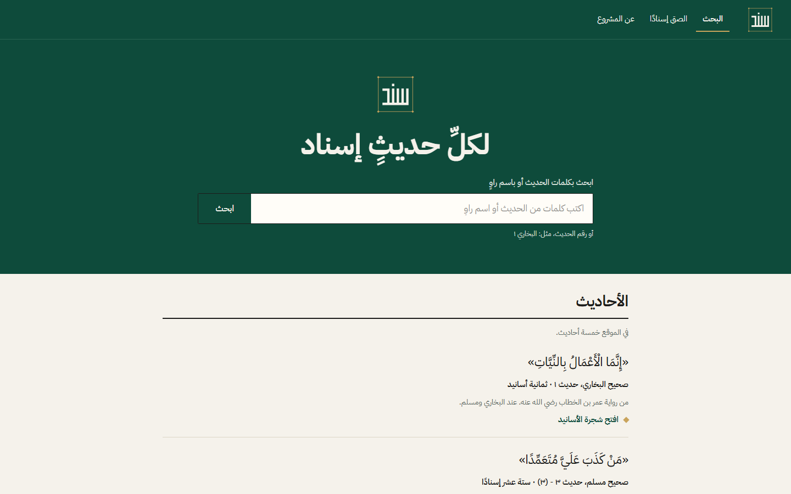
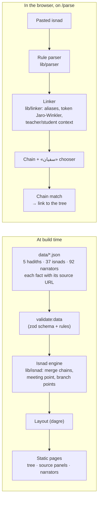

<p align="center">
  
</p>

<h1 align="center">Sanad (سَنَد)</h1>

<p align="center"><strong dir="rtl">لكلِّ حديثٍ إسناد</strong><br>Every hadith has its isnad.</p>

<p align="center">
  An Arabic, right-to-left web app that merges every chain of narration (isnad) of one hadith into a single interactive, source-linked tree.
</p>

<p align="center">
  <a href="https://sanad-pi-five.vercel.app"><strong>Live demo →</strong></a>
</p>

<p align="center">
  <a href="https://github.com/Malik-712/sanad/actions/workflows/ci.yml"></a>
  
  
  
</p>

Built for the AI Challenge — Serving Islamic Content, **Track 04: knowledge and verification tools** (4–6 Oct 2026).

## What is an isnad, and what does Sanad do?

An **isnad** is the chain of people who passed a hadith on, from the Prophet ﷺ to the scholar who wrote it down in a book («حدثنا فلان، عن فلان، عن فلان…»). One hadith usually reaches the books through several isnads. To see where they meet and where they split, a student draws them by hand into one tree (*tashjīr*).

Sanad does this from sourced data:

- **One tree per hadith.** All isnads of the hadith merged: the Prophet ﷺ at the top, the compilers at the bottom, the meeting point (*madār*, common link) and the points where isnads split marked on the tree.
- **Every isnad links to its source:** book, edition, number, volume, page and the page itself. Rulings are only quoted, with who said them.
- **Narrators:** tap a narrator to see his entry quoted from *Taqrib al-Tahdhib* with its page.
- **Paste an isnad (`/parse`):** Sanad reads the names and transmission words, links each name to a narrator record with a confidence state, draws the chain, and finds it in a tree if it is one of ours. A name shared by two narrators («سفيان») is never decided silently: the user chooses. The text never leaves the browser.

| Home and search | Tree and source panel | Paste an isnad |
| --- | --- | --- |
|  |  |  |

## How Sanad treats hadith

- **Every fact has a source.** Hadith text, isnads, book numbers and pages are copied word for word from a source page, and its URL is stored next to the fact. If there is no source, the interface says «لا مصدر بعد».
- **Sanad quotes, it never grades.** A ruling is shown only as a quote with who said it and where.
- **When unsure, it says so.** Unchecked data and uncertain links are marked «يحتاج تحققًا» with candidates to choose from, never a silent guess.

> أداة مساعدة بالذكاء الاصطناعي، لا تحكم على الأحاديث ولا تُفتي

## How it works



**The machine-learning part, measured and not published.** A narrator tagger (Arabic BERT-mini) was fine-tuned on Sanadset 650K and compared with the rule parser on 300 isnads from 9 books it never saw (`docs/EVALUATION.md`):

| Reader | Precision | Recall | F1 | Whole chain exact |
| --- | --- | --- | --- | --- |
| Rules (live on the site) | 0.816 | 0.706 | 0.757 | 33.3 % |
| Model, ONNX int8, 12.24 MB | 0.892 | 0.941 | 0.916 | 71.7 % |

The model is clearly better, but **it is not published and does not run on the site**: the licence of its training data is unclear (owner decision, 6 Oct). The live site runs the rule parser. Everything to reproduce the model is in [`ml/README.md`](ml/README.md).

## Run locally

Needs Node 20.9 or newer and pnpm (`corepack enable` or `npm i -g pnpm`).

```bash
pnpm install
pnpm dev                 # http://localhost:3000
```

## Test

```bash
pnpm lint                # ESLint
pnpm test                # 130 unit tests (Vitest): engine, parser, linker, normaliser, data rules
pnpm validate:data       # every isnad has a source, every narrator exists, ...
pnpm build               # production build (runs validate:data first)

pnpm eval:all            # unit tests + hard cases ×3 (identical hashes) + the 37 routes end to end
pnpm hardcases --runs 3  # 15 hard cases, writes docs/HARD_CASES.md

pnpm build && pnpm test:e2e                                 # 35 Playwright tests at 390 and 1440 px (Edge)
BASE_URL=https://sanad-pi-five.vercel.app pnpm test:e2e     # the same tests on the live site
bash scripts/lighthouse.sh https://sanad-pi-five.vercel.app 3   # Lighthouse, median of 3 runs
```

Playwright uses the Microsoft Edge installed on the machine (`channel: "msedge"`); change `channel` in `playwright.config.ts` for another browser. The ML steps (Python, CPU only) are in [`ml/README.md`](ml/README.md).

## Results (measured on 6 Oct 2026)

| What | Result | Where |
| --- | --- | --- |
| Hard cases (ambiguous names, unknown narrator, broken chain, not an isnad, «ح», tashkeel, …) | 15 / 15 pass; 3 runs, identical SHA-256 | [`docs/HARD_CASES.md`](docs/HARD_CASES.md) |
| Real routes pasted on `/parse` | right tree found with no help for 27 of 37 | [`docs/EVALUATION.md`](docs/EVALUATION.md) (b) |
| Accessibility (axe, WCAG 2.1 A/AA) | 0 serious or critical issues on every page at 390 and 1440 px | `tests/e2e/` |
| End-to-end tests | 35 / 35 locally and on the live site | `tests/e2e/` |
| Live links | 100 pages, 0 broken internal links; 89 / 89 shamela.ws source links answer; 0 console errors | `scripts/check-links.mjs` |
| Lighthouse (live, median of 3 runs) | 5 pages × mobile and desktop: Performance 96–100; Accessibility, Best practices, SEO 100 | [`docs/EVALUATION.md`](docs/EVALUATION.md) (c) |
| User test (5 users, by hand vs Sanad) | protocol ready; **not run yet** | [`docs/USER_TEST.md`](docs/USER_TEST.md) |

## Limits

- **5 hadiths** (37 isnads, from al-Bukhari and Muslim) and 92 narrator records. The narrator records are sourced but not yet checked by the owner, so they show «يحتاج تحققًا».
- The rule parser misses story-style isnads («قلت لفلان…») and two isnads written in one text; such names come out unlinked or need choosing.
- A tree shows the isnads we copied, not every isnad of the hadith that exists.
- The dorar.net grade links sit behind Cloudflare bot protection; a visitor may occasionally see a Cloudflare check before the page.
- Sanad never grades a hadith or a narrator, and it is not a fatwa tool.

## Repository map

| Path | Contents |
| --- | --- |
| `app/` | Pages: Home, hadith, narrator, paste, about |
| `components/` | Tree, panels, paste page, layout, UI |
| `lib/` | `isnad/` engine, `parser/` rule parser, `linker/` narrator linking, `data/` schema and loading, `copy/ar.ts` all Arabic text |
| `data/` | Hadiths and narrators as JSON, each with its source |
| `ml/` | Narrator tagger: data preparation, training, evaluation, export (Python, CPU) |
| `scripts/` | Data validation, evaluations, hard cases, Lighthouse, user-test handouts |
| `tests/` | Playwright tests, hard cases, shared fixtures |
| `docs/` | Sources, evaluation, requirements, judging guide, cost, user test, video and pitch scripts |

## Documentation

- [docs/JUDGES.md](docs/JUDGES.md): five things to try on the live site, and one command for the numbers
- [docs/REQUIREMENTS.md](docs/REQUIREMENTS.md): each official requirement → feature → evidence
- [docs/SOURCES.md](docs/SOURCES.md): scholarly sources, how text is taken and checked, how to verify any fact
- [docs/EVALUATION.md](docs/EVALUATION.md): model vs rules, routes end to end, Lighthouse
- [docs/HARD_CASES.md](docs/HARD_CASES.md): the hard cases and their results
- [docs/COST.md](docs/COST.md): cost, dependencies, upkeep and fallbacks
- [docs/USER_TEST.md](docs/USER_TEST.md): the 5-user test protocol
- [docs/SOURCES_LOG.md](docs/SOURCES_LOG.md): every tool, model, dataset and package, with its licence
- [docs/BASELINE.md](docs/BASELINE.md): the earlier project `sanad2`, and what was reused
- [docs/PROGRESS.md](docs/PROGRESS.md): what was done, session by session
- [CLAUDE.md](CLAUDE.md): project rules, scholarly rules, schema and design tokens

## AI use and sources

Sanad is built with Claude Code and Claude Design, with human review of the code and of every scholarly fact. The full log of AI tools, models, data and open-source packages, with licences, is in [docs/SOURCES_LOG.md](docs/SOURCES_LOG.md). An earlier version of the project exists and is disclosed in [docs/BASELINE.md](docs/BASELINE.md). The repository history was scanned for keys and passwords on 6 Oct (56 commits): none found.

## Licence

All rights reserved — see [LICENSE](LICENSE). Third-party packages keep their own licences, listed in [docs/licenses/](docs/licenses/).
