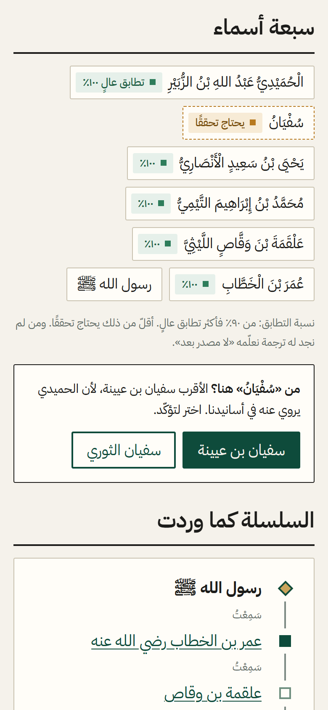
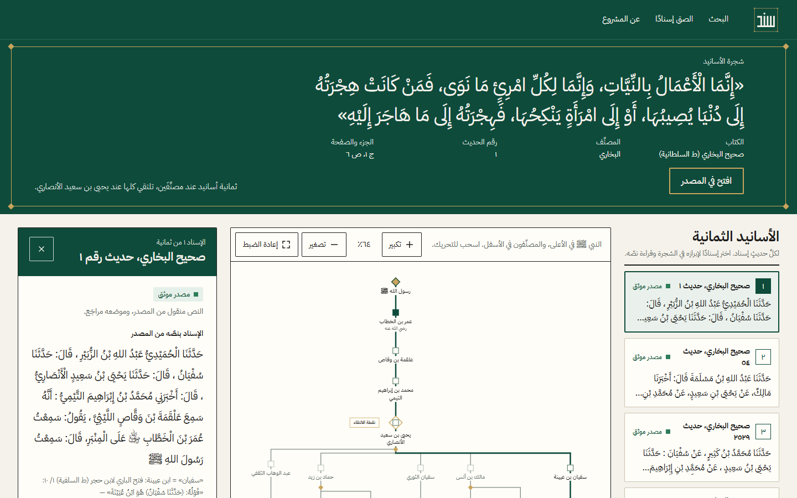
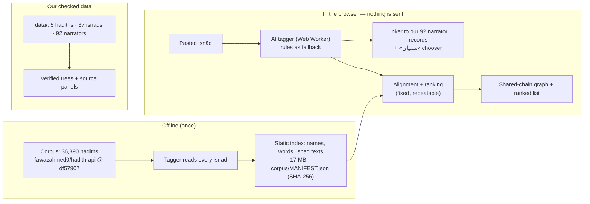

<p align="center">
  
</p>

<h1 align="center">Sanad (سَنَد)</h1>

<p align="center"><strong dir="rtl">لكلِّ حديثٍ إسناد</strong><br>Every hadith has its isnad.</p>

<p align="center">
  The <strong>Smart Isnād Explorer</strong>: paste an isnād, an AI model reads it in your browser, and Sanad finds every hadith that has the same or a close isnād and draws the shared chain.
</p>

<p align="center">
  <a href="https://sanad-pi-five.vercel.app"><strong>Live demo →</strong></a>
</p>

<p align="center">
  <a href="https://github.com/Malik-712/sanad/actions/workflows/ci.yml"></a>
  
  
  
</p>

Built for the AI Challenge — Serving Islamic Content, **Track 04: knowledge and verification tools** (4–6 Oct 2026).

## What is an isnad, and what does Sanad do?

An **isnad** is the chain of people who passed a hadith on («حدثنا فلان، عن فلان، عن فلان…»). The same chain, or a close one, often stands behind several hadiths in several books. Finding them all, and seeing where the chains meet and split, is slow work by hand.

You paste an isnād. Then:

1. **The AI reads it.** A small neural tagger (BERT-mini, fine-tuned by us) finds the narrator names and the transmission words, **in your browser** — the text never leaves it. If the model cannot load, the rule parser takes over by itself and the page says so.
2. **Sanad matches.** The names are aligned, in order, with the isnād of every hadith in a corpus of **36,390 hadiths** (Bukhari, Muslim, Abu Dawud, Tirmidhi, Nasa'i, Ibn Majah, Muwatta), whose isnāds were read by the same model.
3. **You see everything found:** a summary («٣ بالإسناد نفسه، ٤ بإسناد قريب»), the **shared chain drawn as an interactive graph** (the pasted chain as the spine, hadiths at the bottom), and the **ranked list** of all matching hadiths with the matched names highlighted, filters by book and match type, and a narrowing box.
4. **Evidence stays separate from the AI.** Every result is a real corpus entry with its book, number and a link to the exact source file. The AI only reads names; matching and ranking are fixed calculations, identical on every run. Sanad never invents a hadith, a narrator, a source or a relationship, and says «لم نجد» when there is nothing.

Our own **5 hadiths with 37 isnāds**, copied word for word from al-Maktaba al-Shamila and checked by the owner, keep their full source panels and trees; a matching isnād also gets a link to them.

| Explorer | Hadith tree and source panel |
| --- | --- |
|  |  |

## How Sanad treats hadith

- **Imported hadiths are never called verified.** They come from an external corpus (fawazahmed0/hadith-api, pinned to commit `df57907`) whose text origin and licence are not stated, and are labelled «يحتاج تحققًا — من مجموعة خارجية لم تُراجَع».
- **Our checked data has a source for every fact.** Text, numbers and pages are copied from a source page whose URL is stored next to it; if there is none, the interface says «لا مصدر بعد».
- **Sanad quotes, it never grades.** No hadith or narrator is called sound or weak in Sanad's own voice. The corpus's grades are not imported.
- **A match is by the name as written.** The corpus has no narrator ids, so two narrators with one name are not told apart; the page says so.

> أداة مساعدة بالذكاء الاصطناعي، لا تحكم على الأحاديث ولا تُفتي

## How it works



**The tagger, measured.** Fine-tuned from `asafaya/bert-mini-arabic` on Sanadset 650K (96,926 isnāds, split by book) and evaluated on 300 isnāds from 9 books it never saw (`docs/EVALUATION.md`):

| Reader | Precision | Recall | F1 | Whole chain exact |
| --- | --- | --- | --- | --- |
| Rules (fallback) | 0.816 | 0.706 | 0.757 | 33.3 % |
| **Model (int8 ONNX, 12.24 MB — what the site runs)** | 0.892 | 0.941 | 0.916 | 71.7 % |

In the browser the model gives the **same labels as the Python one on 100.00 % of 14,789 words** (`pnpm check:tagger`).

**The explorer, measured** on our 37 verified isnāds (`pnpm eval:explorer`): all 18 Bukhari isnāds find their own hadith in the first 3 results (median rank 1) with both readers. The model is not better than the rules on this small set; `docs/EVALUATION.md` (d) shows the table.

**Licences, openly.** The tagger is derived from `bert-mini-arabic` and trained on Sanadset 650K; **both have unclear licences**. Publishing the model is the owner's decision (6 Oct), recorded in `docs/SOURCES_LOG.md` and shown on the `/sources` page.

## Run locally

Needs Node 20.9 or newer and pnpm (`corepack enable` or `npm i -g pnpm`).

```bash
pnpm install
pnpm dev                 # http://localhost:3000
```

The corpus files (`public/corpus/`) and the model (`public/models/sanad-ner/`) are in the repository. To rebuild the corpus from the pinned source: `python ml/index_corpus.py`, then `pnpm build:corpus` (steps in [`ml/README.md`](ml/README.md)).

## Test

```bash
pnpm lint                # ESLint
pnpm test                # unit tests (Vitest): explorer, matching, graph, parser, linker, engine, data rules
pnpm validate:data       # every verified isnad has a source, every narrator exists, ...
pnpm build               # production build (copies the onnxruntime wasm, validates data first)

pnpm eval:all            # unit tests + hard cases ×3 (identical hashes) + the 37 routes end to end
pnpm eval:explorer       # the explorer on the 37 verified isnāds, rules vs the shipped model
pnpm check:tagger        # the browser tagger code vs the Python labels on 300 isnāds
pnpm hardcases --runs 3  # 15 hard cases, writes docs/HARD_CASES.md

pnpm build && pnpm test:e2e                                 # Playwright at 390 and 1440 px (Edge), incl. axe and the privacy test
BASE_URL=https://sanad-pi-five.vercel.app pnpm test:e2e     # the same on the live site
bash scripts/lighthouse.sh https://sanad-pi-five.vercel.app 3   # Lighthouse, median of 3 runs
```

Playwright uses the Microsoft Edge installed on the machine (`channel: "msedge"`); change it in `playwright.config.ts` for another browser.

## Limits

- **The AI misreads some names** (F1 0.916 on held-out books). The corpus isnāds are read by the same model, so a match can be missed or listed as «close». The score is always shown.
- **A match is by the name as written**, not proof of the same person.
- **The corpus is external and unverified**, with no stated text origin or licence; its numbering differs from printed editions (notably Muslim). Only our 5 hadiths are checked against their books.
- **No tree for imported hadiths:** the corpus has isnād text only, no narrator ids and no grouping of the same hadith across books.
- The first visit downloads the 12 MB model (cached afterwards); a slow connection falls back to the rules after 15 s.
- Sanad never grades a hadith or a narrator, and it is not a fatwa tool.

## Repository map

| Path | Contents |
| --- | --- |
| `app/` | Pages: Home (the explorer), `/c/<book>/<n>` hadith page, verified hadith and narrator pages, sources, about |
| `components/` | `explorer/` results and hadith page; `parse/` reading step; tree, panels, layout, UI |
| `lib/` | `explorer/` matching and graph, `corpus/` books and name folding, `ml/` browser tagger and worker, `parser/` rule parser, `linker/`, `isnad/` engine, `data/`, `copy/ar.ts` all Arabic text |
| `data/` | Our verified hadiths and narrators as JSON, each with its source |
| `corpus/`, `public/corpus/` | The external corpus build: manifest with hashes, and the static index files |
| `public/models/` | The trained tagger (int8 ONNX) |
| `ml/` | Training, evaluation, export, and the corpus reading pass (Python, CPU) |
| `scripts/` | Corpus build, evaluations, hard cases, Lighthouse, link checker |
| `tests/` | Playwright tests, hard cases, shared fixtures |
| `docs/` | Sources, evaluation, requirements, judging guide, cost, user test, video and pitch scripts |

## Documentation

- [docs/JUDGES.md](docs/JUDGES.md): five things to try on the live site, and one command for the numbers
- [docs/REQUIREMENTS.md](docs/REQUIREMENTS.md): each official requirement → evidence
- [docs/EVALUATION.md](docs/EVALUATION.md): tagger, explorer, Lighthouse and accessibility results
- [docs/SOURCES.md](docs/SOURCES.md): scholarly sources and how to verify them; [docs/SOURCES_LOG.md](docs/SOURCES_LOG.md): every tool, model, dataset and package with its licence
- [docs/HARD_CASES.md](docs/HARD_CASES.md), [docs/COST.md](docs/COST.md), [docs/USER_TEST.md](docs/USER_TEST.md), [docs/BASELINE.md](docs/BASELINE.md), [docs/PROGRESS.md](docs/PROGRESS.md)
- [CLAUDE.md](CLAUDE.md): project rules, scholarly rules, schema and design tokens

## AI use and sources

Sanad is built with Claude Code and Claude Design, with human review of the code and of every scholarly fact. The full log of AI tools, models, data and open-source packages, with licences, is in [docs/SOURCES_LOG.md](docs/SOURCES_LOG.md). An earlier version of the project exists and is disclosed in [docs/BASELINE.md](docs/BASELINE.md). The repository history was scanned for keys and passwords on 6 Oct (56 commits at the time): none found.

## Licence

All rights reserved — see [LICENSE](LICENSE). Third-party packages keep their own licences, listed in [docs/licenses/](docs/licenses/).
